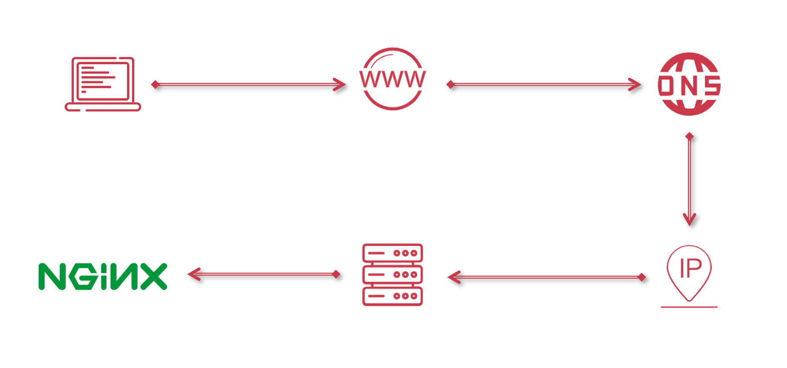
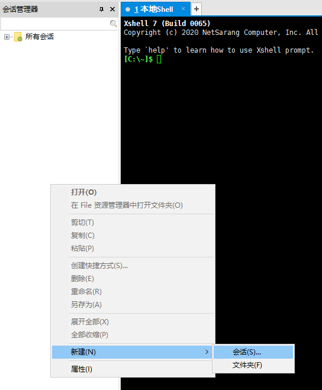
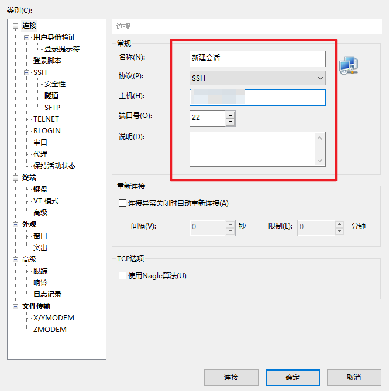
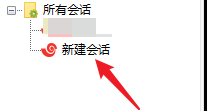
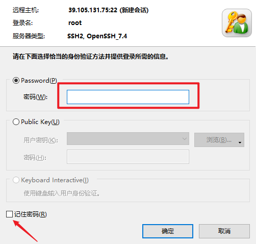
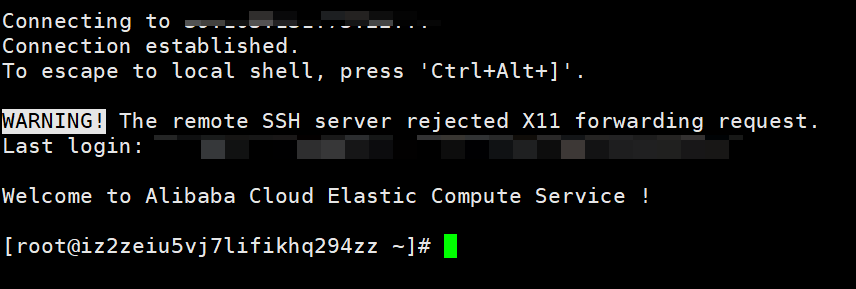

<!-- START doctoc generated TOC please keep comment here to allow auto update -->
<!-- DON'T EDIT THIS SECTION, INSTEAD RE-RUN doctoc TO UPDATE -->
**Table of Contents**  *generated with [DocToc](https://github.com/thlorenz/doctoc)*

- [项目部署](#%E9%A1%B9%E7%9B%AE%E9%83%A8%E7%BD%B2)
  - [项目构建过程分析与实现](#%E9%A1%B9%E7%9B%AE%E6%9E%84%E5%BB%BA%E8%BF%87%E7%A8%8B%E5%88%86%E6%9E%90%E4%B8%8E%E5%AE%9E%E7%8E%B0)
  - [域名、DNS、公网IP、服务器、Nginx之间的关系](#%E5%9F%9F%E5%90%8Ddns%E5%85%AC%E7%BD%91ip%E6%9C%8D%E5%8A%A1%E5%99%A8nginx%E4%B9%8B%E9%97%B4%E7%9A%84%E5%85%B3%E7%B3%BB)
  - [阿里云服务器购买指南](#%E9%98%BF%E9%87%8C%E4%BA%91%E6%9C%8D%E5%8A%A1%E5%99%A8%E8%B4%AD%E4%B9%B0%E6%8C%87%E5%8D%97)
  - [服务器连接方式](#%E6%9C%8D%E5%8A%A1%E5%99%A8%E8%BF%9E%E6%8E%A5%E6%96%B9%E5%BC%8F)
  - [Nginx 环境处理](#nginx-%E7%8E%AF%E5%A2%83%E5%A4%84%E7%90%86)
  - [项目发布](#%E9%A1%B9%E7%9B%AE%E5%8F%91%E5%B8%83)

<!-- END doctoc generated TOC please keep comment here to allow auto update -->

# 项目部署


## 项目构建过程分析与实现


**为什么需要打包项目：**

浏览器只能识别并运行 **`html、css、js` 文件** 。

那么换句话而言，项目中的 `.vue` 文件，浏览器是不认识的。

而打包的过程就是把 `.vue` 的 **单文件组件** 打包成 `html、css、js` 的文件，让浏览器进行识别，并展示项目

**打包之后项目可以通过浏览器直接访问吗？**

通过 `npm run build` 打包项目之后，打包的文件会被放入到 `dist` 文件夹中，其实我们可以直接双击 `index.html` 文件，可以发现，浏览器是 **无法** 显示项目的。

打开 `F12` 可以发现，终端中抛出了很多的错误。

那么根据这些错误可以知道，无法显示的原因是因为 **一些文件找不到了**。

那么为什么找不到呢？

查看的 `url` 可以发现，其实的 `url` 是一个 `file` 协议。那么对应的文件路径就会编程 `盘符下的 xxx` ，在我们当前的盘符下没有对应的文件，那么自然是无法找到的。

而想要解决这个问题的话，就需要把我们的项目运行到一个 **服务** 中，就像开发时的 [devServer](https://webpack.docschina.org/configuration/dev-server/) 一样。

**为什么需要有服务？**

需要通过一个 **服务** 托管我们的项目，从而避免出现模块无法被找到等问题。

----------

通过 `npm run build` 打包项目。


## 域名、DNS、公网IP、服务器、Nginx之间的关系

概念：

1. 域名
2. DNS：域名解析服务器
3. 公网IP：服务器在网络中的唯一地址
4. 服务器：服务部署的电脑
5. Nginx：网页服务




## 阿里云服务器购买指南

[云服务器 ECS 自定义购买](https://ecs-buy.aliyun.com/wizard/#/prepay/cn-beijing?fromDomain=true)

## 服务器连接方式

常见的连接服务器的方式有三种：

1. 阿里云控制台中进行远程链接
2. **通过 `SSH` 工具**（[XShell](https://www.netsarang.com/en/xshell/)）
3. `SSH` 指令远程登录

这里使用第二种 **通过 `SSH` 工具**（[XShell](https://www.netsarang.com/en/xshell/)）进行连接。

1. 新建会话

2. 确定会话信息，协议为 `SSH`、主机为服务器 IP、端口号为 22

3. 双击会话进行连接

4. 输入用户名（默认为 `root`）

5. 输入密码

6. 连接成功


## Nginx 环境处理

1. `nginx` 编译时依赖 `gcc` 环境

   ```
   yum -y install gcc gcc-c++
   ```

2. 安装 `prce`，让 `nginx` 支持重写功能

   ```
   yum -y install pcre*
   ```

3. 安装 `zlib`，`nginx` 使用 `zlib` 对 `http` 包内容进行 `gzip` 压缩

   ```
   yum -y install zlib zlib-devel 
   ```

4. 安装 `openssl`，用于通讯加密

   ```
   yum -y install openssl openssl-devel
   ```

5. 进行 `nginx` 安装

6. 创建 `nginx` 文件夹

7. 下载 `nginx` 压缩包

   ```
   wget https://nginx.org/download/nginx-1.11.5.tar.gz
   ```

8. 解压 `nginx`

   ```
   tar -zxvf  nginx-1.11.5.tar.gz
   ```

9. 进入 `nginx-1.11.5` 目录

   ```
   cd nginx-1.11.5
   ```

10. 检查平台安装环境

    ```
    ./configure --prefix=/usr/local/nginx
    ```

11. 进行源码编译

    ```
    make 
    ```

12. 安装 `nginx`

    ```
    make install
    ```

13. 查看 `nginx` 配置

    ```
    /usr/local/nginx/sbin/nginx -t
    ```

14. 制作 `nginx` 软连接

15. 进入 `usr/bin` 目录

    ```
    cd /usr/bin
    ```

16. 制作软连接

    ```
    ln -s /usr/local/nginx/sbin/nginx nginx
    ```

17. 接下来制作配置文件

18. 首先进入到 `nginx` 的默认配置文件中

    ```
    vim /usr/local/nginx/conf/nginx.conf
    ```

19. 在最底部增加配置项（按下 `i` 进入 输入模式）

    ```
    include /nginx/*.conf;
    ```

20. 按下 `esc` 键，通过 `:wq!` 保存并退出

21. 创建新的配置文件

    ```
    touch /nginx/nginx.conf
    ```

22. 进入到 `/root/nginx/nginx.conf` 文件

    ```
    vim /nginx/nginx.conf
    ```

23. 写入如下配置

    ```js
    # imooc-admin
    server {
        # 端口
        listen       80;
        # 域名
        server_name  localhost;
        # 资源地址
        root   /nginx/dist/;
        # 目录浏览
        autoindex on;
        # 缓存处理
        add_header Cache-Control "no-cache, must-revalidate";
        # 请求配置
        location / {
            # 跨域
            add_header Access-Control-Allow-Origin *;
            # 返回 index.html
            try_files $uri $uri/ /index.html;
        }
    }
    ```

24. 通过 `:wq!` 保存退出

25. 在 `root/nginx` 中创建 `dist` 文件夹

    ```
    mkdir /nginx/dist
    ```

26. 在 `nginx/dist` 中写入 `index.html` 进行测试

27. 通过 `nginx -s reload` 重启服务

28. 在 浏览器中通过，`IP` 测试访问

## 项目发布

可以通过 [XFTP](https://www.netsarang.com/en/xftp/) 进行数据传输


