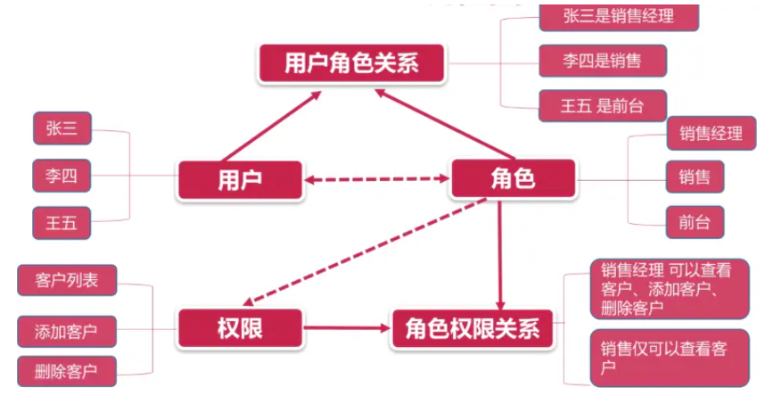

<!-- START doctoc generated TOC please keep comment here to allow auto update -->
<!-- DON'T EDIT THIS SECTION, INSTEAD RE-RUN doctoc TO UPDATE -->
**Table of Contents**  *generated with [DocToc](https://github.com/thlorenz/doctoc)*

- [分级分控权限模块](#%E5%88%86%E7%BA%A7%E5%88%86%E6%8E%A7%E6%9D%83%E9%99%90%E6%A8%A1%E5%9D%97)
  - [权限理论：RBAC 权限控制体系](#%E6%9D%83%E9%99%90%E7%90%86%E8%AE%BArbac-%E6%9D%83%E9%99%90%E6%8E%A7%E5%88%B6%E4%BD%93%E7%B3%BB)
  - [辅助业务](#%E8%BE%85%E5%8A%A9%E4%B8%9A%E5%8A%A1)
    - [角色列表展示](#%E8%A7%92%E8%89%B2%E5%88%97%E8%A1%A8%E5%B1%95%E7%A4%BA)
    - [权限列表展示](#%E6%9D%83%E9%99%90%E5%88%97%E8%A1%A8%E5%B1%95%E7%A4%BA)
    - [为用户分配角色](#%E4%B8%BA%E7%94%A8%E6%88%B7%E5%88%86%E9%85%8D%E8%A7%92%E8%89%B2)
    - [为角色指定权限](#%E4%B8%BA%E8%A7%92%E8%89%B2%E6%8C%87%E5%AE%9A%E6%9D%83%E9%99%90)
  - [基于 RBAC 的权限控制体系原理与实现分析](#%E5%9F%BA%E4%BA%8E-rbac-%E7%9A%84%E6%9D%83%E9%99%90%E6%8E%A7%E5%88%B6%E4%BD%93%E7%B3%BB%E5%8E%9F%E7%90%86%E4%B8%8E%E5%AE%9E%E7%8E%B0%E5%88%86%E6%9E%90)
  - [业务落地](#%E4%B8%9A%E5%8A%A1%E8%90%BD%E5%9C%B0)
    - [定义页面权限控制动作，实现页面权限受控](#%E5%AE%9A%E4%B9%89%E9%A1%B5%E9%9D%A2%E6%9D%83%E9%99%90%E6%8E%A7%E5%88%B6%E5%8A%A8%E4%BD%9C%E5%AE%9E%E7%8E%B0%E9%A1%B5%E9%9D%A2%E6%9D%83%E9%99%90%E5%8F%97%E6%8E%A7)
    - [重置路由表数据](#%E9%87%8D%E7%BD%AE%E8%B7%AF%E7%94%B1%E8%A1%A8%E6%95%B0%E6%8D%AE)
    - [创建功能受控指令](#%E5%88%9B%E5%BB%BA%E5%8A%9F%E8%83%BD%E5%8F%97%E6%8E%A7%E6%8C%87%E4%BB%A4)

<!-- END doctoc generated TOC please keep comment here to allow auto update -->

<!--
 * @Author: hidari
 * @Date: 2022-06-02 15:31:45
 * @LastEditors: hidari 
 * @LastEditTime: 2022-06-02 16:47:05
 * @FilePath: \vue3-integrated-back-office-solution\src\markdown\permission.md
 * @Description: 分级分控权限模块
 * 
 * Copyright (c) 2022 by 1640106564@qq.com, All Rights Reserved. 
-->
# 分级分控权限模块

1. 权限理论：明确什么是 `RBAC` 权限控制体现
2. 辅助业务：完善 用户、角色、权限 三个页面功能
3. 核心功能：落地实现 `RBAC` 权限控制系统

## 权限理论：RBAC 权限控制体系

本项目中，可以通过：

1. 员工管理为用户指定角色
2. 通过角色列表为角色指定权限
3. 通过权限列表查看当前项目所有权限

以上三条就制定了一个用户由：**用户 -> 角色 -> 权限** 的一个分配关系。

当用户通过角色为某一个用户指定到不同的权限之后，那么该用户就会在 **项目中体会到不同权限的功能**

那么这样的一套关系就是 `RBAC` 权限控制体系，也就是 **基于 角色的权限 控制 用户的访问**

通过以下图片可以很好的说明这种权限控制体系的含义：



## 辅助业务

辅助业务具体指的就是：

1. 员工管理（用户列表）
   1. 为用户分配角色
2. 角色列表
   1. 角色列表展示
   2. 为角色分配权限
3. 权限列表
   1. 权限列表展示

### 角色列表展示

1. 创建 `api/role` 接口文件：

```js
import request from '@/utils/request'

/**
 * 获取所有角色
 */

export const getRolesList = () => request({
  url: '/role/list'
})
```

2. 在 `views/role-list` 中获取数据

```js
import { getRolesList } from '@/api/role'
import { watchSwitchLang } from '@/utils/i18n'
import { ref } from 'vue'
const allRoles = ref([])
const getRoleList = async () => {
  allRoles.value = await getRolesList()
}
getRoleList()

watchSwitchLang(getRoleList)
```

3. 通过 [el-table](https://element-plus.org/zh-CN/component/table.html) 进行数据展示

```vue
<template>
    <div class="">
    <el-card>
        <el-table :data="allRoles" border style="width: 100%">
        <el-table-column :label="$t('msg.role.index')" type="index" width="120">
        </el-table-column>
        <el-table-column :label="$t('msg.role.name')" prop="title">
        </el-table-column>
        <el-table-column :label="$t('msg.role.desc')" prop="describe">
        </el-table-column>
        <el-table-column
            :label="$t('msg.role.action')"
            prop="action"
            width="260"
        >
            <el-button type="primary" size="mini">
            {{ $t('msg.role.assignPermissions') }}
            </el-button>
        </el-table-column>
        </el-table>
    </el-card>
    </div>
</template>
```

### 权限列表展示

1. 创建 `getPermissionList` API
```js
/**
 * 获取所有权限
 */
export const getPermissionList = () => request({
  url: '/permission/list'
})
```

2. 在 `views/permission-list` 获取数据

```js
import { getPermissionList } from '@/api/role'
import { watchSwitchLang } from '@/utils/i18n'
import { ref } from 'vue'
/**
 * 权限分级：
 * 1. 一级权限为页面权限
 *  permissionMark 对应 路由名称
 * 2. 二级权限为功能权限
 *  permissionMark 对应 功能权限表
 */
// 所有权限
const allPermission = ref([])
const permissionList = async () => {
  allPermission.value = await getPermissionList()
}
permissionList()

watchSwitchLang(permissionList)
```

3. 通过 [el-table](https://element-plus.org/zh-CN/component/table.html) 进行数据展示

```vue
<template>
    <div class="">
    <el-card>
        <el-table
        :data="allPermission"
        style="width: 100%; margin-bottom: 20px"
        row-key="id"
        border
        default-expand-all
        :tree-props="{ children: 'children', hasChildren: 'hasChildren' }"
        >
        <el-table-column
            prop="permissionName"
            :label="$t('msg.permission.name')"
            width="180"
        >
        </el-table-column>
        <el-table-column
            prop="permissionMark"
            :label="$t('msg.permission.mark')"
            width="180"
        >
        </el-table-column>
        <el-table-column
            prop="permissionDesc"
            :label="$t('msg.permission.desc')"
        >
        </el-table-column>
        </el-table>
    </el-card>
    </div>
</template>
```

### 为用户分配角色

1. 创建为用户分配角色弹出层 `views/user-manage/components/roles`

```vue
<template>
    <el-dialog
    :title="$t('msg.excel.roleDialogTitle')"
    :model-value="modelValue"
    @close="closed"
    >
    内容

    <template #footer>
        <span class="dialog-footer">
        <el-button @click="closed">{{ $t('msg.universal.cancel') }}</el-button>
        <el-button type="primary" @click="onConfirm">{{
            $t('msg.universal.confirm')
        }}</el-button>
        </span>
    </template>
    </el-dialog>
</template>

<script setup>
import { defineProps, defineEmits } from 'vue'
defineProps({
    modelValue: {
    type: Boolean,
    required: true
    }
})
const emits = defineEmits(['update:modelValue'])

/**
    确定按钮点击事件
*/
const onConfirm = async () => {
    closed()
}

/**
* 关闭
*/
const closed = () => {
    emits('update:modelValue', false)
}
</script>

<style lang="scss" scoped></style>

```

2. 在 `user-manage` 中点击查看，展示弹出层

```html
<roles-dialog v-model="roleDialogVisible"></roles-dialog>
```
```js
import RolesDialog from './components/roles.vue'

/**
* 查看角色的点击事件
*/
const roleDialogVisible = ref(false)
const onShowRoleClick = row => {
    roleDialogVisible.value = true
}
```

3. 在弹出层中需要利用 [el-checkbox](https://element-plus.org/zh-CN/component/checkbox.html) 进行数据展示，此时数据分为两种：

   1. 所有角色（已存在）
   2. 用户当前角色

4. 所以需要先获取对应数据 在 `api/role` 中定义获取用户当前角色接口

```js
/**
 * 获取指定用户角色
 */
export const getUserRoles = (id) => request({
  url: `/user-manage/role/${id}`
})
```

5. 在 `roles` 组件中获取所有角色数据

```js
import { defineProps, defineEmits, ref } from 'vue'
import { roleList } from '@/api/role'
import { watchSwitchLang } from '@/utils/i18n'
...

// 所有角色
const allRoleList = ref([])
// 获取所有角色数据的方法
const getListData = async () => {
    allRoleList.value = await roleList()
}
getListData()
watchSwitchLang(getListData)

// 当前用户角色
const userRoleTitleList = ref([])
```

6. 利用 [el-checkbox](https://element-plus.org/zh-CN/component/checkbox.html) 渲染所有角色

```html
    <el-checkbox-group v-model="userRoleTitleList">
        <el-checkbox
        v-for="item in allRoleList"
        :key="item.id"
        :label="item.title"
        ></el-checkbox>
    </el-checkbox-group>
```

7. 接下来渲染选中项，即：用户当前角色

8. 调用 `userRoles` 接口需要 **当前用户 ID**，所以需要定义对应的 `props`

```js
const props = defineProps({
    ...
    userId: {
    type: String,
    required: true
    }
})
```

9. 接下来可以根据 `userId` 获取数据

注意：**因为该 `userId` 需要在 `user-manage` 用户点击之后获取当前点击行的 `id`。所以在 `roles` 组件的初始状态下，获取到的 `userId` 为 `null` 。** 因此想要根据 `userId` 获取用户当前角色数据，需要 `watch userId` 在 `userId` 有值的前提下，获取数据

```js
// 当前用户角色
const userRoleTitleList = ref([])

// 获取当前角色
const getUserRole = async () => {
  const res = await getUserRoles(props.userId)
  userRoleTitleList.value = res.role.map(item => item.title)
}

// 因为在点击时才能获取到 userId 所以一开始传递的 userId是空值
// 需要 watch 监听变化 userId 有值再获取
watch(() => props.userId, (val) => {
  if (val) getUserRole()
})
```

10. 在 `user-manage` 中传递数据

```html
<roles-dialog
    v-model="roleDialogVisible"
    :userId="selectUserId"
></roles-dialog>
```
```js
const selectUserId = ref('')
const onShowRoleClick = row => {
    selectUserId.value = row._id
}
```

11. 在 `dialog` 关闭时重置 `selectUserId`
`src\views\user-manage\index.vue`
```js
/**
 * 因为只有在切换角色时才会触发查看角色接口
 * 所以用 watch 监听dialog关闭事件 把 selectUserId 置空
 * 保证每次打开 dialog 都能获取到数据
 */
watch(roleDialogVisible, val => {
  if (!val) selectUserId.value = ''
})
```

12. 在 `api/role` 中定义分配角色接口

```js
/**
 * 分用户分配角色
 */
export const updateRole = (id, roles) => request({
  url: `/user-manage/update-role/${id}`,
  method: 'POST',
  data: {
    roles
  }
})
```

13. 点击确定调用接口并发送事件
`src\views\user-manage\components\roles.vue`
```js
/**
  确定按钮点击事件
 */
const i18n = useI18n()
const onConfirm = async () => {
  // 处理数据结构
  const roles = userRoleTitleList.value.map(title => {
    return allRoleList.value.find(role => role.title === title)
  })

  await updateRole(props.userId, roles)
  ElMessage.success(i18n.t('msg.role.updateRoleSuccess'))

  // 通知父组件 角色更新成功
  emits('updateRole')
  closed()
}
```

14. 在 `user-manage` 中监听角色更新成功事件，重新获取数据

```html
<roles-dialog
    v-model="roleDialogVisible"
    :userId="selectUserId"
    @updateRole="getListData"
></roles-dialog>
```

### 为角色指定权限

> 为角色指定权限通过 **弹出层中的 [树形控件](https://element-plus.org/zh-CN/component/tree.html) 处理**

1. 创建 为角色指定权限弹出层

```vue
<template>
    <el-dialog
    :title="$t('msg.excel.roleDialogTitle')"
    :model-value="modelValue"
    @close="closed"
    >
    内容

    <template #footer>
        <span class="dialog-footer">
        <el-button @click="closed">{{ $t('msg.universal.cancel') }}</el-button>
        <el-button type="primary" @click="onConfirm">{{
            $t('msg.universal.confirm')
        }}</el-button>
        </span>
    </template>
    </el-dialog>
</template>

<script setup>
import { defineProps, defineEmits } from 'vue'
defineProps({
    modelValue: {
    type: Boolean,
    required: true
    }
})
const emits = defineEmits(['update:modelValue'])

/**
    确定按钮点击事件
*/
const onConfirm = async () => {
    closed()
}

/**
* 关闭
*/
const closed = () => {
    emits('update:modelValue', false)
}
</script>
```

2. 在 `roles-list` 中点击查看，展示弹出层

```vue
<template>
    <div class="">
    <el-card>
        <el-table :data="allRoles" border style="width: 100%">
        ...
        <el-table-column
            ...
            #default="{ row }"
        >
            <el-button
            type="primary"
            size="mini"
            @click="onDistributePermissionClick(row)"
            >
            {{ $t('msg.role.assignPermissions') }}
            </el-button>
        </el-table-column>
        </el-table>
    </el-card>

    <distribute-permission
        v-model="distributePermissionVisible"
    ></distribute-permission>
    </div>
</template>

<script setup>
...
import DistributePermission from './components/DistributePermission.vue'

...

/**
* 分配权限
*/
const distributePermissionVisible = ref(false)
const onDistributePermissionClick = row => {
    distributePermissionVisible.value = true
}
</script>

```

3. 在弹出层中需要利用 [el-tree](https://element-plus.org/zh-CN/component/tree.html) 进行数据展示，此时数据分为两种：

   1. 所有权限（已存在）
   2. 角色对应的权限

4. 所以需要先获取对应数据

5. 在 `api/role` 中定义获取角色当前权限

```js
/**
 * 获取指定角色的权限
 */
export const rolePermission = (roleId) => request({
  url: `/role/permission/${roleId}`
})
```

6. 在 `DistributePermission` 组件中获取所有权限数据

```js
import { defineProps, defineEmits, ref } from 'vue'
import { permissionList } from '@/api/permission'
import { watchSwitchLang } from '@/utils/i18n'
...

// 所有权限
const allPermission = ref([])
const getPermissionList = async () => {
    allPermission.value = await permissionList()
}
getPermissionList()
watchSwitchLang(getPermissionList)
```

7. 使用  [el-tree](https://element-plus.org/zh-CN/component/tree.html) 渲染权限数据

```vue
<template>
    ...
    <el-tree
        ref="treeRef"
        :data="allPermission"
        show-checkbox
        check-strictly
        node-key="id"
        default-expand-all
        :props="defaultProps"
    >
    </el-tree>
...
</template>

<script setup>
...
// 属性结构配置
const defaultProps = {
    children: 'children',
    label: 'permissionName'
}
...
</script>

```

8. 接下来渲染选中项，即：角色当前权限

9. 调用 `rolePermission` 接口需要 **当前角色 ID**，所以我们需要定义对应的 `props`

```js
const props = defineProps({
    modelValue: {
    type: Boolean,
    required: true
    },
    roleId: {
    type: String,
    required: true
    }
})
```

10. 在 `role-list` 中传递角色ID

```html
<distribute-permission
    v-model="distributePermissionVisible"
    :roleId="selectRoleId"
></distribute-permission>
```
```js
/**
 * 分配权限
 */
const selectRoleId = ref('')
const onDistributePermissionClick = row => {
    selectRoleId.value = row.id
}
```

11. 调用 `rolePermission` 接口获取数据

```js
import { rolePermission } from '@/api/role'


// 获取当前用户角色的权限
const getRolePermission = async () => {
    const checkedKeys = await rolePermission(props.roleId)
    console.log(checkedKeys)
}

/**
 * 点击才能获取到 roleId 一开始是 undefined 所以用 watch 监听
 */
watch(() => props.roleId, val => {
  if (val) getRolePermission()
})
```

12. 根据获取到的数据渲染选中的 `tree`

```js
// tree 节点
const treeRef = ref(null)
// 当前角色的权限
const getRolePermission = async () => {
  const checkedKeys = await rolePermission(props.roleId)
  // el-tree 组件传递的是 node-key="id" id
  // 所以把传来的 key 传递进去就可以显示了
  treeRef.value.setCheckedKeys(checkedKeys)
}
```

13. 在 `api/role` 中定义分配权限接口

```js
/**
 * 为角色修改权限
 */
export const distributePermission = (data) => request({
  url: '/role/distribute-permission',
  method: 'POST',
  data
})
```

14. 点击确定调用接口

```js
import { rolePermission, distributePermission } from '@/api/role'
import { useI18n } from 'vue-i18n'
import { ElMessage } from 'element-plus'

/**
  确定按钮点击事件
 */
const i18n = useI18n()
const onConfirm = async () => {
  await distributePermission({
    roleId: props.roleId,
    permissions: treeRef.value.getCheckedKeys()
  })
  ElMessage.success(i18n.t('msg.role.updateRoleSuccess'))
  closed()
}
```

## 基于 RBAC 的权限控制体系原理与实现分析

> `RBAC` 是基于 **用户 -> 角色 -> 权限** 的 **基于 角色的权限 控制 用户的访问** 的体系。

在这套体系中，最基层的就是 **权限部分** ：
1. 先为 **员工角色** 指定 **空权限**
2. 然后为 **测试用户** 指定 **员工角色**
3. 此时重新登录 **测试用户**
4. 可以发现左侧菜单中仅存在 **个人中心** 页面
5. 然后重新登录 **超级管理员** 账号
6. 为 **员工角色** 指定 **员工管理 && 分配角色** 权限
7. 然后为的 **测试用户** 指定指定 **员工角色**
8. 此时重新登录 **测试用户**
9. 可以发现左侧菜单中多出 **员工管理** 页面，并且页面中仅存在指定的 **分配角色** 功能

整个权限系统其实分成了两部分：

1. 页面权限：比如 员工管理
2. 功能权限：比如 分配角色

其中 **页面权限** 表示：当前用户可以访问的页面

**功能权限** 表示：当前用户可以访问的权限功能（PS：并非所有功能有需要权限）

**页面权限：**

所谓页面权限包含两部分内容：

1. 用户可看到的：左侧 `menu` 菜单的 `item` 展示
2. 用户看不到的：路由表配置

**左侧 `menu` 菜单是根据路由表自动生成的。** 所以以上第一部分的内容其实就是由第二部分引起的。

**路由表配置：**

路由表分成两部分：

1. 私有路由表 `privateRoutes`：依据权限进行动态配置的
2. 公开路由表 `publicRoutes`：无权限要求的

**页面权限** 核心的点就是在 **私有路由表 `privateRoutes`**

期望：**不同的权限进入系统可以看到不同的路由** 。换句话就是：**根据不同的权限数据，生成不同的私有路由表**

对于 `vue-router 4` ，提供了 [addRoute API](https://next.router.vuejs.org/zh/api/#addroute) ，可以 **动态添加路由到路由表中**，本项目利用此 `API` 生成不同的路由表数据。

总结：

1. 页面权限实现的核心在于 **路由表配置**
2. 路由表配置的核心在于 **私有路由表 `privateRoutes`**
3. 私有路由表 `privateRoutes` 的核心在于 **[addRoute API](https://next.router.vuejs.org/zh/api/#addroute)**

**根据不同的权限数据，利用  [addRoute API](https://next.router.vuejs.org/zh/api/#addroute) 生成不同的私有路由表 ** 即可实现 **页面权限** 功能

**功能权限：**

1. 根据不同的 **权限数据**，展示不同的 **功能按钮**

思路：**根据权限数据，隐藏功能按钮**

实现方案：

**页面权限：**

1. 获取 **权限数据**
2.  **私有路由表** 不再被直接加入到 `routes` 中
3. 利用 [addRoute API](https://next.router.vuejs.org/zh/api/#addroute) 动态添加路由到 **路由表** 中

**功能权限：**

1. 获取 **权限数据**
2. 定义 **隐藏按钮方式**（通过指令）
3. 依据数据隐藏按钮

## 业务落地
### 定义页面权限控制动作，实现页面权限受控

1. 页面权限数据在 **`userInfo -> permission -> menus` 之中**

2. **私有路由表** 不再被直接加入到 `routes` 中

```js
export const privateRoutes = [...]
export const publicRoutes = [...]

const router = createRouter({
    history: createWebHashHistory(),
    routes: publicRoutes
})
```

3. 利用 [addRoute API](https://next.router.vuejs.org/zh/api/#addroute) 动态添加路由到 **路由表** 中

- 定义添加的动作，通过`vuex` 模块进行
- 创建 `store/modules/permission` 模块
```js
import { publicRoutes, privateRoutes } from '@/router'
export default {
  namespaced: true,
  state: () => ({
    // 路由表： 初始时拥有的路由表
    routes: publicRoutes
  }),
  mutations: {
    /**
     * 增加路由
     * @param {*} state
     * @param {*} newRoutes 需要新增进去的路由
     */
    setRoutes (state, newRoutes) {
      // 永远在静态路由的基础上增加新路由
      state.routes = [...publicRoutes, ...newRoutes]
    }
  },
  actions: {
    /**
     * 根据权限数据筛选路由
     * @param {*} context
     * @param {*} menus 权限数据
     */
    filterRoutes ({ commit }, menus) {
    }
  }
}
```

- `filterRoutes`筛选路由动作
    - 为每个权限路由指定一个 `name`，每个 `name` 对应一个 **页面权限**
    - 通过 `name` 与 **页面权限** 匹配的方式筛选出对应的权限路由
    - 需要对现有的私有路由表进行重制

- 创建 `router/modules` 文件夹 写入 5 个页面权限路由

- `userManage.js`
```js
import layout from '@/layout'

export default {
  path: '/user',
  component: layout,
  redirect: '/user/manage',
  name: 'userManage',
  meta: {
    title: 'user',
    icon: 'personnel'
  },
  children: [
    {
      path: '/user/manage',
      component: () => import('@/views/user-manage/index'),
      meta: {
        title: 'userManage',
        icon: 'personnel-manage'
      }
    },
    {
      path: '/user/info/:id',
      name: 'userInfo',
      component: () => import('@/views/user-info/index'),
      props: true,
      meta: {
        title: 'userInfo'
      }
    },
    {
      path: '/user/import',
      name: 'import',
      component: () => import('@/views/import/index'),
      meta: {
        title: 'excelImport'
      }
    }
  ]
}
```

- `roleList.js`

```js
import layout from '@/layout'

export default {
  path: '/user',
  component: layout,
  redirect: '/user/manage',
  name: 'roleList',
  meta: {
    title: 'user',
    icon: 'personnel'
  },
  children: [
    {
      path: '/user/role',
      component: () => import('@/views/role-list/index.vue'),
      meta: {
        title: 'roleList',
        icon: 'role'
      }
    }
  ]
}
```

- `permissionList.js`

```js
import layout from '@/layout'

export default {
  path: '/user',
  component: layout,
  redirect: '/user/manage',
  name: 'permissionList',
  meta: {
    title: 'user',
    icon: 'personnel'
  },
  children: [
    {
      path: '/user/permission',
      component: () => import('@/views/permission-list/index'),
      meta: {
        title: 'permissionList',
        icon: 'permission'
      }
    }
  ]
}
```

- `article.js`
```js
import layout from '@/layout'

export default {
  path: '/article',
  component: layout,
  redirect: '/article/ranking',
  name: 'articleRanking',
  meta: { title: 'article', icon: 'article' },
  children: [
    {
      path: '/article/ranking',
      component: () => import('@/views/article-ranking/index'),
      meta: {
        title: 'articleRanking',
        icon: 'article-ranking'
      }
    },
    {
      path: '/article/:id',
      component: () => import('@/views/article-detail/index'),
      meta: {
        title: 'articleDetail'
      }
    }
  ]
}
```

- `articleCreate.js`

```js
import layout from '@/layout'

export default {
  path: '/article',
  component: layout,
  redirect: '/article/ranking',
  name: 'articleCreate',
  meta: { title: 'article', icon: 'article' },
  children: [
    {
      path: '/article/create',
      component: () => import('@/views/article-create/index'),
      meta: {
        title: 'articleCreate',
        icon: 'article-create'
      }
    },
    {
      path: '/article/editor/:id',
      component: () => import('@/views/article-create/index'),
      meta: {
        title: 'articleEditor'
      }
    }
  ]
}
```

- 在 `router/index` 中合并这些路由到 `privateRoutes` 中

```js
import ArticleCreaterRouter from './modules/ArticleCreate'
import ArticleRouter from './modules/Article'
import PermissionListRouter from './modules/PermissionList'
import RoleListRouter from './modules/RoleList'
import UserManageRouter from './modules/UserManage'

export const asyncRoutes = [
    RoleListRouter,
    UserManageRouter,
    PermissionListRouter,
    ArticleCreaterRouter,
    ArticleRouter
]
```

- 此时所有的 **权限页面** 都拥有一个名字，这个名字与 **权限数据** 匹配

- 可以据此生成 **权限路由表数据**
```js
/**
 * 根据权限数据筛选路由
 * @param {*} context
 * @param {*} menus 权限数据
 */
filterRoutes ({ commit }, menus) {
    // 筛选之后获取到的需要通过 addRoute 进行添加的路由表数组
    const routes = []
    // 路由权限匹配
    menus.forEach(key => {
    // 权限名 与 路由的 name 匹配
    routes.push(...privateRoutes.filter(item => item.name === key))
    })
    // 最后添加 不匹配路由进入 404
    routes.push(
    // 所有不匹配的路由都会进入 404 的路由配置
    // 注意 该配置需要在所有路由指定之后
    // 本来应该写在 router/index.js 但是要保证在所有路由之后 加到动态路由后面
    {
        // 捕获不存在的路由 正则
        path: '/:catchAll(.*)',
        redirect: '/404'
    })
    commit('setRoutes', routes)

    return routes
}
```

- 在 `store/index` 中设置该 `modules`

```js
...
export default createStore({
getters,
modules: {
    ...
    permission
}
})

```

- 在 `src/permission` 中，获取用户数据之后调用该动作

```js
// 判断用户资料是否获取
// 若不存在用户信息，则需要获取用户信息
if (!store.getters.hasUserInfo) {
    // 触发获取用户信息的 action
    const { permission } = await store.dispatch('user/getUserInfo')
    // 处理用户权限 筛选出需要添加的路由
    const filterRoutes = await store.dispatch('permission/filterRoutes', permission.menus)
    // 循环添加动态路由
    filterRoutes.forEach(item => {
    router.addRoute(item)
    })
    // 添加完动态路由后需要进行一次主动跳转 这样添加的路由才能生效
    return next(to.path)
}
next()
```

- 因为主动获取了 `getUserInfo` 动作的返回值，所以在 `getUserInfo` 中 `return res` 不然是 `undefined`
```js
/**
 * 获取用户信息
 * @param commit
 * @returns {Promise<AxiosResponse<any>>}
 */
async getUserInfo ({ commit }) {
    const res = await getUserInfo()
    commit('setUserInfo', res)
    return res
}
```

### 重置路由表数据

问题：重新登录权限账户，不刷新页面，左侧菜单不会自动改变。

原因：**退出登录时，添加的路由表并未被删除**

解决方案：在退出登录时，删除动态添加的路由表。

1. 在 `router/index` 中定义 `resetRouter` 方法

```js
/**
 * 初始化路由表
 */
export const resetRouter = () => {
  if (
    store.getters.userInfo &&
        store.getters.userInfo.permission &&
        store.getters.userInfo.permission.menus
  ) {
    const menus = store.getters.userInfo.permission.menus
    menus.forEach((menu) => {
      router.removeRoute(menu)
    })
  }
}
```

2. 在退出登录的动作下，触发该方法
`src\store\modules\user.js`
```js
import router, { resetRouter } from '@/router'

/**
 * 退出登录
 */
logout ({ commit }) {
    commit('setToken', '')
    commit('setUserInfo', {})
    removeAllItem()
    // 清理权限相关配置
    resetRouter()
    router.push('/login')
}
```

### 创建功能受控指令

> 实现功能权限的核心在于 **根据数据隐藏功能按钮**，隐藏的方式可以通过指令进行。
> （[vue3 自定义指令](https://v3.cn.vuejs.org/guide/custom-directive.html#%E7%AE%80%E4%BB%8B)）

1. 期望最终可以通过这样格式的指令进行功能受控 `v-permission="['importUser']"`

2. 创建对应的自定义指令 `directives/permission`

```js
import store from '@/store'
/**
 * 检查是否具有权限
 */
const checkPermission = (el, binding) => {
  // 获取对应权限
  // value 获取传递过来的值
  const { value } = binding
  // 获取当前用户的所有功能权限
  const points = store.getters.userInfo.permission.points
  // value 必须是一个数组
  if (value && value instanceof Array) {
    // 匹配对应的指令
    // some() 方法用于检测数组中的元素是否满足指定条件
    /**
     * some() 方法会依次执行数组的每个元素：
     * 如果有一个元素满足条件，则表达式返回true , 剩余的元素不会再执行检测。
     * 如果没有满足条件的元素，则返回false。
     * 注意： some() 不会对空数组进行检测。
     * 注意： some() 不会改变原始数组。
     */
    // JS中除了some()还有every()方法，与some()方法相反
    const hasPermission = points.some(points => {
      return value.includes(points)
    })
    // 如果无法匹配，则表示当前用户无该指令，那么删除对应的功能按钮(el元素)
    if (!hasPermission) {
      el.parentNode && el.parentNode.removeChild(el)
    }
  } else {
    throw new Error('v-permission value is ["admin","editor"]')
  }
}

export default {
  // 在绑定元素的父组件被挂载后调用
  mounted (el, binding) {
    checkPermission(el, binding)
  },
  // 在包含组建的 Vnode 及其子组件的 Vnode 更新后调用
  update (el, binding) {
    checkPermission(el, binding)
  }
}
```

3. 在 `directives/index` 中绑定该指令

```js
...
import permission from './permission'

export default (app) => {
    ...
    app.directive('permission', permission)
}

```

4. 在所有功能中，添加该指令
`views/role-list/index`

```html
<el-button
    ...
    v-permission="['distributePermission']"
>
{{ $t('msg.role.assignPermissions') }}
</el-button>
```

`views/user-manage/index`

```html
<el-button
    ...
    v-permission="['importUser']"
>
{{ $t('msg.excel.importExcel') }}</el-button
        >
```

```html
<el-button
    ...
    v-permission="['distributeRole']"
>{{ $t('msg.excel.showRole') }}</el-button
>
```

```html
<el-button
    ...
    v-permission="['removeUser']"
>{{ $t('msg.excel.remove') }}</el-button
>
```